# MyNotePad 项目功能说明

## 一. 项目设计思路

1. **核心目标**：打造一个轻量化、功能实用的记事本应用，重点解决用户日常记录的便捷性和管理效率问题。

2. **主要功能模块**：
   - **基础功能**：实现笔记的创建、编辑、删除等基本操作。
   - **时间显示**：记录笔记的创建和修改时间，帮助用户按时间梳理信息。
   - **快速检索**：支持关键字搜索，提升笔记查询效率。
   - **分类管理**：通过对笔记进行分组分类，优化笔记管理逻辑。
   - **个性化界面**：提供更换背景颜色、字体大小的功能，增强用户体验。
   - **待办事项**：支持将笔记标记为待办事项，便于任务管理。

3. **用户需求分析**：
   - 用户希望快速记录信息，避免复杂交互。
   - 笔记数量较多时需要高效检索和分类功能。
   - 界面风格需简洁清晰并具备一定的美化选项。
   - 需要支持待办事项管理功能。

4. **技术选型与实现**：
   - **数据存储**：使用 SQLite 数据库保存笔记数据。
   - **界面交互**：基于 Android 原生 UI 组件实现动态布局与功能绑定。
   - **模块化开发**：将功能拆分为独立模块，易于维护和扩展。
   - **内容提供者**：使用 ContentProvider 实现数据访问的封装和安全控制。

## 二. 项目功能实现

### 1. 笔记基础功能

**功能描述**：实现笔记的创建、编辑、删除等基本操作，满足用户日常记录需求。

**实现思路**：
- 使用 ContentProvider 封装数据访问，确保数据安全性。
- 使用 NoteEditor 活动处理创建和编辑。
- 通过 ContentResolver 操作数据实现删除。

**核心代码**：
```java
创建：
@Override
public boolean onOptionsItemSelected(MenuItem item) {
    if (item.getItemId() == R.id.menu_add) {
        Intent insertIntent = new Intent(Intent.ACTION_INSERT, getIntent().getData());
        insertIntent.setClassName(this, "com.example.android.notepad.NoteEditor");
        startActivity(insertIntent);
        return true;
    }
}
if (Intent.ACTION_INSERT.equals(action) || Intent.ACTION_PASTE.equals(action)) {
    mState = STATE_INSERT;
    mUri = getContentResolver().insert(intent.getData(), null);
}
编辑：
private final void updateNote(String text, String title) {
    ContentValues values = new ContentValues();
    values.put(NotePad.Notes.COLUMN_NAME_MODIFICATION_DATE, System.currentTimeMillis());
    values.put(NotePad.Notes.COLUMN_NAME_TITLE, title);
    values.put(NotePad.Notes.COLUMN_NAME_NOTE, text);
    getContentResolver().update(mUri, values, null, null);
}
删除：
@Override
public boolean onContextItemSelected(MenuItem item) {
    if (id == R.id.context_delete) {
        getContentResolver().delete(noteUri, null, null);
        return true;
    }
}

private final void deleteNote() {
    if (mCursor != null) {
        mCursor.close();
        mCursor = null;
        getContentResolver().delete(mUri, null, null);
        mText.setText("");
    }
}
```

**效果展示**：
- 点击按钮创建新笔记
- 点击笔记项进入编辑界面修改内容，支持删除操作

**截图展示**：


### 2. 时间显示功能

**功能描述**：在笔记列表中直观展示每条笔记的修改时间，便于用户查看记录时间。

**实现思路**：
- 在数据库中保存每条笔记的创建和修改时间戳。

**核心代码**：
```java
@Override
public void bindView(View view, Context context, Cursor cursor) {
    long timestamp = cursor.getLong(COLUMN_INDEX_MODIFICATION_DATE);
    Date date = new Date(timestamp);
    SimpleDateFormat dateFormat = new SimpleDateFormat("yyyy-MM-dd HH:mm");
    String dateText = dateFormat.format(date);
    noteView.setText(noteContent + "\n" + dateText);
}
```

**效果展示**：
- 笔记列表中每条记录下方显示最后修改时间
- 时间格式为"年-月-日 时:分:秒"，清晰易读

**截图展示**：

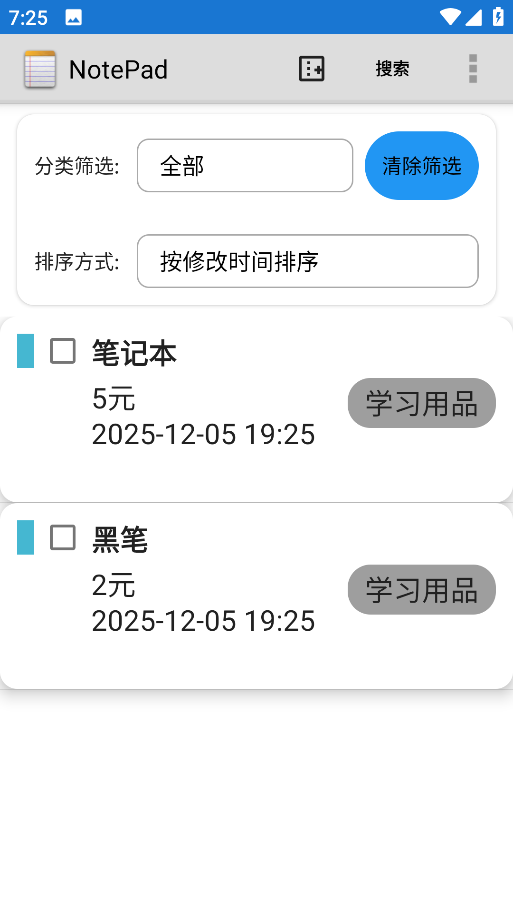

### 3. 搜索功能

**功能描述**：支持按关键字搜索笔记内容，快速定位所需信息。

**实现思路**：
- 提供搜索对话框，获取用户输入的搜索关键字。
- 根据关键字构建查询条件，过滤显示匹配的笔记。
- 提供清除搜索按钮，恢复显示所有笔记。

**核心代码**：
```java
// 显示搜索对话框
private void showSearchDialog() {
    AlertDialog.Builder builder = new AlertDialog.Builder(this);
    builder.setTitle("搜索笔记");
    final EditText input = new EditText(this);
    builder.setView(input);
    builder.setPositiveButton("搜索", new DialogInterface.OnClickListener() {
        @Override
        public void onClick(DialogInterface dialog, int which) {
            mSearchFilter = input.getText().toString();
            refreshNoteList();
        }
    });
    builder.setNegativeButton("取消", null);
    builder.show();
}

// 刷新笔记列表
private void refreshNoteList() {
    String selection = null;
    String[] selectionArgs = null;
    
    // 构建搜索条件
    if (!TextUtils.isEmpty(mSearchFilter)) {
        selection = NotePad.Notes.COLUMN_NAME_TITLE + " LIKE ? OR " + 
                    NotePad.Notes.COLUMN_NAME_NOTE + " LIKE ?";
        selectionArgs = new String[] { "%" + mSearchFilter + "%", "%" + mSearchFilter + "%" };
    }
    
    // 执行查询
    mCursor = managedQuery(
        getIntent().getData(),
        PROJECTION,
        selection,
        selectionArgs,
        mCurrentSortOrder
    );
    setListAdapter(new NotesListAdapter(this, mCursor));
}
```

**效果展示**：
- 点击搜索按钮弹出搜索对话框
- 输入关键字后显示匹配的笔记
- 支持按标题和内容搜索

**截图展示**：

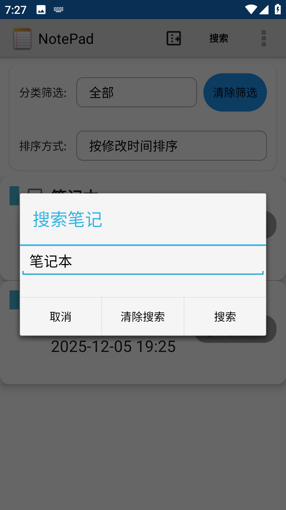
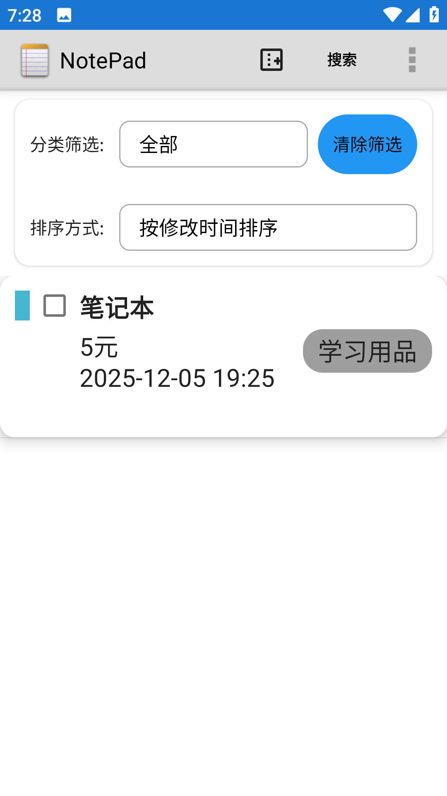

### 4. 分类管理功能

**功能描述**：支持为笔记添加分类标签，实现笔记的分类管理和筛选。

**实现思路**：
- 在数据库中添加分类相关字段（名称、颜色）。
- 提供分类筛选下拉菜单，支持按分类查看笔记。
- 实现分类管理对话框，支持添加、编辑和删除分类。

**核心代码**：
```java
// 分类筛选初始化
private void initCategoryFilter() {
    mCategorySpinner = findViewById(R.id.category_spinner);
    // 查询所有分类
    Cursor cursor = getContentResolver().query(
        NotePad.Categories.CONTENT_URI,
        new String[] { NotePad.Categories._ID, NotePad.Categories.COLUMN_NAME_NAME },
        null, null, null
    );
    SimpleCursorAdapter adapter = new SimpleCursorAdapter(
        this, android.R.layout.simple_spinner_item, cursor,
        new String[] { NotePad.Categories.COLUMN_NAME_NAME },
        new int[] { android.R.id.text1 }, 0
    );
    mCategorySpinner.setAdapter(adapter);
}
```

**效果展示**：
- 笔记列表顶部提供分类筛选下拉框
- 选择分类后仅显示该分类下的笔记

**截图展示**：

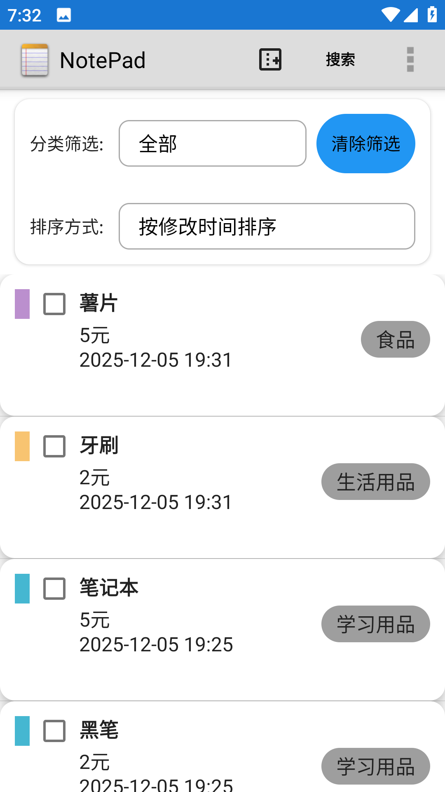
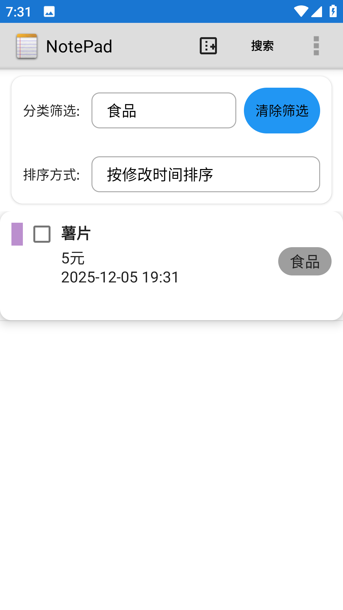

### 5. 待办事项功能

**功能描述**：将笔记标记为待办事项，支持待办状态的切换（未完成/已完成）。

**实现思路**：
- 在数据库中添加待办状态字段。
- 在笔记编辑界面提供待办事项图标，点击切换状态。
- 在笔记列表中通过不同图标显示待办状态。

**核心代码**：
```java
// 待办状态切换
private void toggleTodoStatus() {
    mTodoStatus = (mTodoStatus == NotePad.Notes.TODO_STATUS_PENDING) 
        ? NotePad.Notes.TODO_STATUS_COMPLETED 
        : NotePad.Notes.TODO_STATUS_PENDING;
    updateTodoIcon();
    ContentValues values = new ContentValues();
    values.put(NotePad.Notes.COLUMN_NAME_TODO_STATUS, mTodoStatus);
    getContentResolver().update(mUri, values, null, null);
}

// 更新待办图标
private void updateTodoIcon() {
    switch (mTodoStatus) {
        case NotePad.Notes.TODO_STATUS_PENDING:
            mTodoIcon.setImageResource(R.drawable.todo_pending);
            break;
        case NotePad.Notes.TODO_STATUS_COMPLETED:
            mTodoIcon.setImageResource(R.drawable.todo_completed);
            break;
        default:
            mTodoIcon.setImageResource(R.drawable.todo_none);
    }
}
```

**效果展示**：
- 笔记编辑界面右上角有待办事项图标
- 点击图标可切换待办状态
- 已完成的待办事项显示勾选图标

**截图展示**：

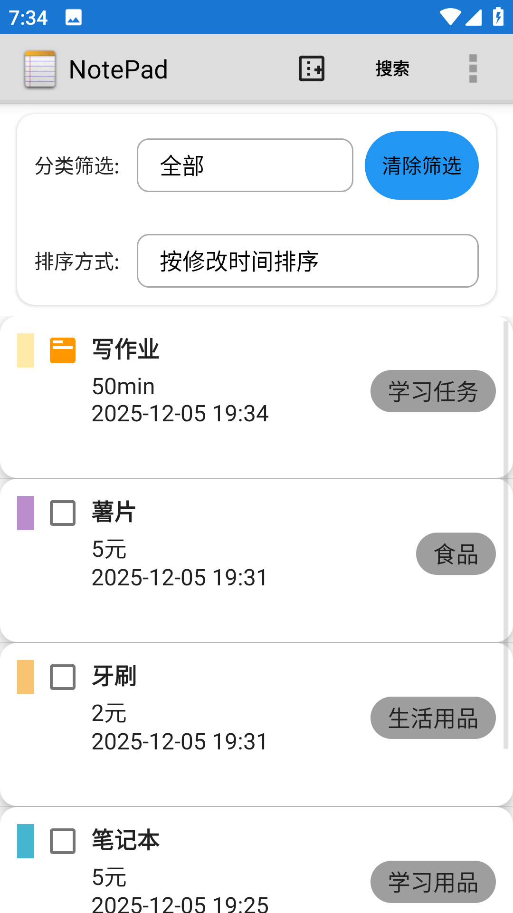
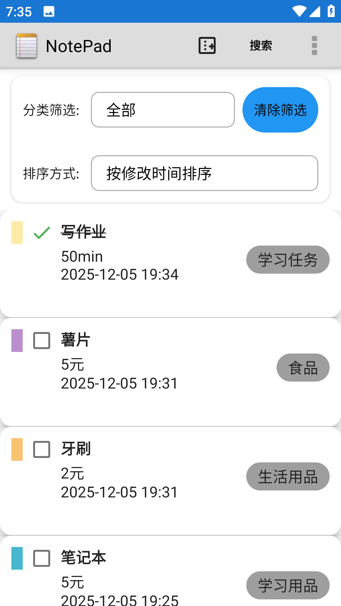

### 5. 个性化主题功能

**功能描述**：支持切换笔记背景颜色和字体大小，满足用户个性化需求。

**实现思路**：
- 使用 SharedPreferences 保存用户主题设置。
- 提供主题管理工具类，统一处理主题应用逻辑。
- 在设置菜单中提供主题切换选项。

**核心代码**：
```java
public class ThemeManager {
    public static final int BACKGROUND_WHITE = 0;
    public static final int BACKGROUND_BLUE = 1;
    public static final int BACKGROUND_YELLOW = 2;
    public static final int BACKGROUND_PINK = 3;
    public static final int BACKGROUND_GREEN = 4;

    public static final int FONT_SIZE_SMALL = 0;
    public static final int FONT_SIZE_MEDIUM = 1;
    public static final int FONT_SIZE_LARGE = 2;
    public static final int FONT_SIZE_XLARGE = 3;

    // 应用背景颜色
    public static void applyBackgroundColor(Activity activity) {
        int mode = getBackgroundColorMode(activity);
        int colorResId = getBackgroundColorResId(mode);
        View rootView = activity.getWindow().getDecorView().getRootView();
        rootView.setBackgroundColor(activity.getResources().getColor(colorResId));
    }

    // 应用字体大小
    public static void applyFontSize(EditText editText, Activity activity) {
        float fontSize = getFontSizeValue(activity);
        editText.setTextSize(fontSize);
    }
}
```

**效果展示**：
- 支持5种背景颜色（白色、蓝色、黄色、粉色、绿色）
- 支持4种字体大小（小、中、大、超大）
- 主题设置即时生效，无需重启应用

**截图展示**：

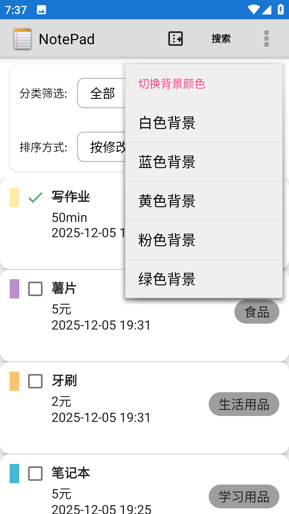

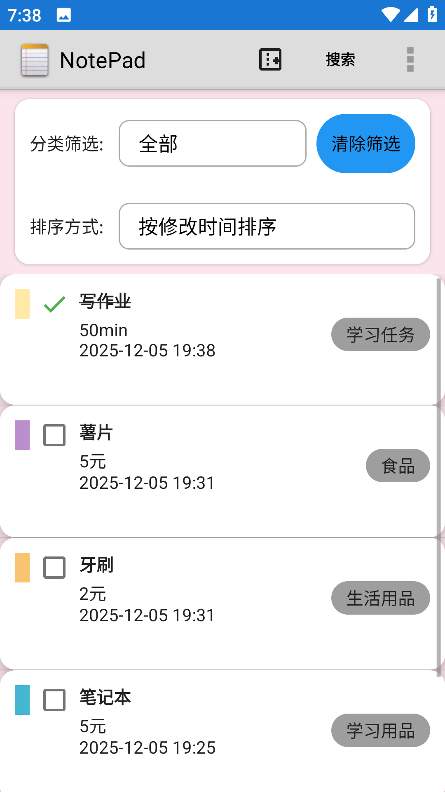


### 7. 排序功能

**功能描述**：支持按多种方式对笔记进行排序，方便用户快速查找和管理笔记。

**实现思路**：
- 提供排序选择器（Spinner），支持多种排序选项。
- 根据用户选择的排序方式构建不同的排序参数。
- 在查询数据库时应用排序参数，更新笔记列表显示顺序。

**核心代码**：
```java
public static final String DEFAULT_SORT_ORDER = "modified DESC";

// NotesList 中的排序初始化
private void initSort() {
    mSortSpinner = (Spinner) findViewById(R.id.sort_spinner);
    
    // 排序选项
    ArrayList<String> sortOptions = new ArrayList<>();
    sortOptions.add("按修改时间排序");
    sortOptions.add("按分类排序");
    sortOptions.add("按待办状态排序");
    ArrayAdapter<String> sortAdapter = new ArrayAdapter<>(
        this, android.R.layout.simple_spinner_item, sortOptions
    );
    sortAdapter.setDropDownViewResource(android.R.layout.simple_spinner_dropdown_item);
    mSortSpinner.setAdapter(sortAdapter);
    mSortSpinner.setOnItemSelectedListener(new AdapterView.OnItemSelectedListener() {
        @Override
        public void onItemSelected(AdapterView<?> parent, View view, int position, long id) {
            switch (position) {
                case 0:
                    // 按修改时间排序（默认）
                    mCurrentSortOrder = NotePad.Notes.DEFAULT_SORT_ORDER;
                    break;
                case 1:
                    // 按分类排序
                    mCurrentSortOrder = NotePad.Notes.COLUMN_NAME_CATEGORY + " ASC";
                    break;
                case 2:
                    // 按待办状态排序
                    mCurrentSortOrder = NotePad.Notes.COLUMN_NAME_TODO_STATUS + " ASC";
                    break;
                default:
                    mCurrentSortOrder = NotePad.Notes.DEFAULT_SORT_ORDER;
            }
            refreshNoteList(); // 刷新笔记列表
        }
        
        @Override
        public void onNothingSelected(AdapterView<?> parent) {
        }
    });
}

// 刷新笔记列表
private void refreshNoteList() {
    mCursor = managedQuery(
        getIntent().getData(),
        PROJECTION,
        selection,
        selectionArgs,
        mCurrentSortOrder
    );
    setListAdapter(new NotesListAdapter(this, mCursor));
}
```

**效果展示**：
- 笔记列表顶部提供排序选择下拉框
- 支持三种排序方式：按修改时间、按分类、按待办状态
- 选择排序方式后，笔记列表即时更新为相应的排序顺序

**截图展示**：


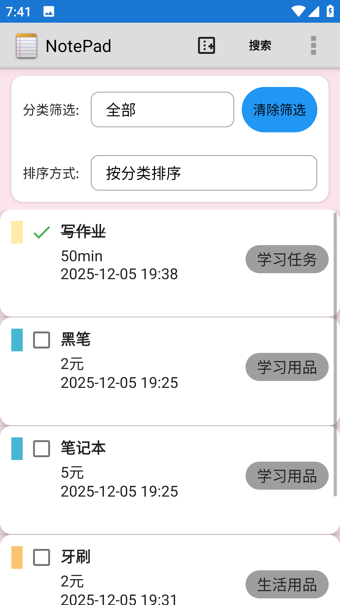
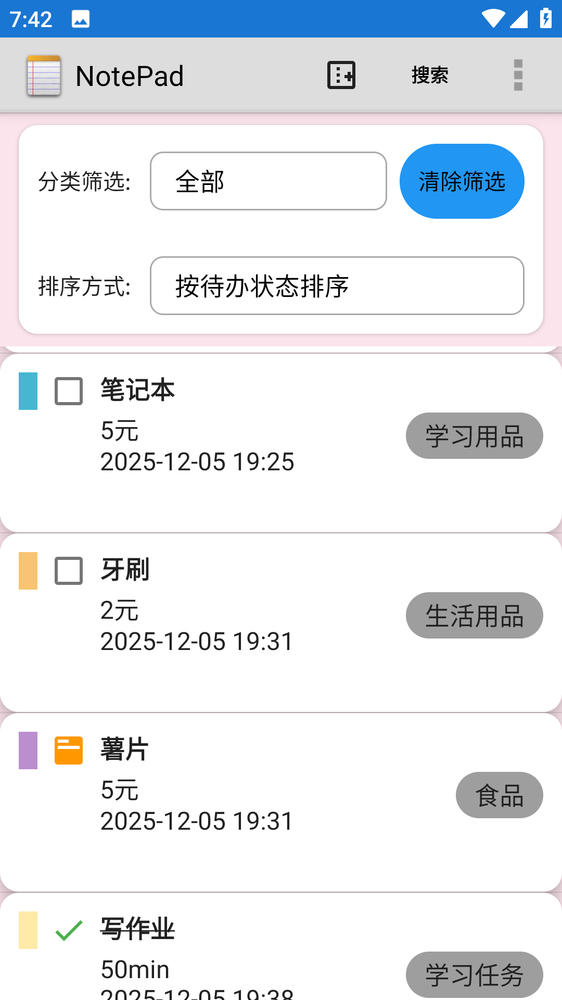

## 三. 关键技术细节

1. **数据存储**：使用 SQLite 数据库存储笔记数据，支持 CRUD 操作及扩展字段（如待办状态、分类等）。
2. **ContentProvider实现**：通过 NotePadProvider 封装数据访问，使用 UriMatcher 处理不同类型的请求，确保数据安全。
3. **动态适配器**：通过自定义 NotesListAdapter，实现笔记列表的动态更新和个性化显示。
4. **排序功能**：使用 Spinner 组件提供多种排序选项（修改时间、分类、待办状态），实现笔记的灵活排序。
5. **主题管理**：基于 SharedPreferences 实现背景颜色和字体大小的个性化设置，实时生效无需重启。
6. **待办事项**：通过整数常量定义待办状态，结合数据库字段和 UI 图标实现直观的任务管理。
7. **查询优化**：使用 SQLiteQueryBuilder 和投影映射优化数据库查询，支持条件筛选和默认排序。
8. **界面交互**：通过监听用户操作（点击、输入等）实现快速响应，使用 Intent 进行组件间通信。

## 四. 项目亮点与扩展方向

1. **项目亮点**
   - **功能完整正确**：不仅支持基础的笔记创建、编辑、删除，还新增待办事项状态标记、笔记分类及分类颜色标识功能，同时支持字体大小调节、背景
                      颜色切换，兼顾基础记录与个性化使用需求。
   - **交互体验友好**：编辑页面实现了带行线的输入区域，提升文本编辑辨识度；
                      笔记列表可直接点击待办图标切换状态，无需进入编辑页；
                      分类筛选、排序、搜索功能联动，能快速定位目标笔记，操作逻辑简洁高效。
   - **架构设计合理**：采用模块化拆分，将 UI 逻辑、数据模型、数据存储、主题管理分离，降低模块耦合度，便于单独迭代与维护。

2. **后续优化方向**
   - **功能智能化拓展**：新增语音输入转文字功能，提升笔记录入效率；
                        引入 OCR 识别，支持将图片中的文字提取至笔记；
                        可添加标签体系，补充分类功能，实现更精细化的笔记管理。
   - **多端与协同能力**：接入云端存储服务，实现笔记数据跨设备同步；
                        支持笔记分享功能，可将笔记以文本或链接形式分享至社交平台，或支持多人协同编辑同一笔记。

MyNotePad 以简洁实用为设计理念，提供了丰富的功能和良好的用户体验，是一款适合日常使用的记事本应用。